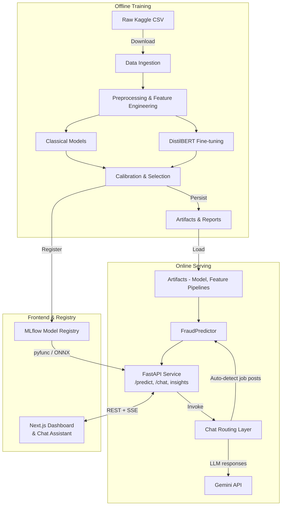
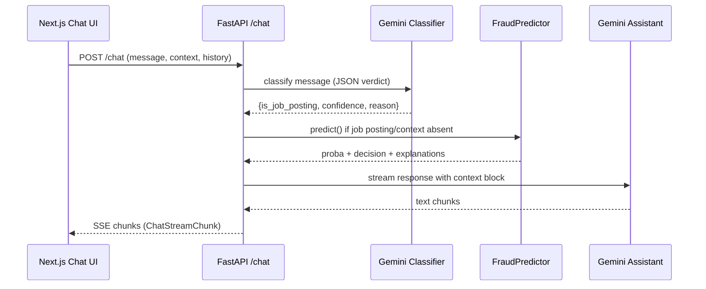

# Spot the Scam - Architecture Overview

This document describes the technical architecture of Spot the Scam across data, modeling, inference, and presentation layers. It also highlights the major modules, data flow, and deployment footprint.

---

## 1. High-Level System Diagram

---

## 2. Repository Layout

| Path | Description |
|------|-------------|
| `configs/` | YAML configs (defaults, overrides). |
| `scripts/` | Utility CLIs (`download_data.py`, `run_api.py`). |
| `src/spot_scam/` | Python package (ETL, features, models, evaluation, inference, API). |
| `artifacts/` | Generated model assets (vectorizers, weights, metadata). |
| `experiments/` | Reports, figures, tables after training. |
| `frontend/` | Next.js + Tailwind + shadcn dashboard. |
| `tests/` | Python unit tests. |

---

## 3. Python Package Architecture

### Key Modules

- **Data ingest / preprocess / split**  
  Standardize columns, drop leakage, compute checksums, stratify into train/val/test with persisted indices.

- **Feature builders**  
  - `features.text`: TF-IDF vectorizer.  
  - `features.tabular`: engineered features (lengths, counts, binary flags).  
  - `features.builders`: orchestrates vectorizer + tabular scaler combo.

- **Models**  
  - `models.classical`: logistic regression, linear SVM, LightGBM with config-driven grids.  
  - `models.transformer`: DistilBERT fine-tune with HF Trainer (AMP + early stopping).

- **Evaluation**  
  - Metrics (F1, PR-AUC, calibration).  
  - Plots (PR, calibration, confusion).  
  - Calibration (Platt / isotonic).  
  - Bias slice analysis.  
  - Markdown report generation.

- **Inference**  
  - `FraudPredictor`: loads artifacts, preprocessing pipelines, and gray-zone policy.  
  - `policy.gray_zone`: threshold band logic.  
  - FastAPI routes (`api.app`) with typed schemas, returning calibrated scores and local explanations per request.
  - MLflow export utilities (`export/mlflow_logger.py`) package ONNX + preprocessing into a pyfunc model for serving parity.

---

## 4. Training Flow (Detailed)

### 4.1 Python Entrypoints

---

## 5. Artifacts & Reporting

| Location                         | Contents                                               |
|----------------------------------|--------------------------------------------------------|
| `artifacts/model.joblib`         | Calibrated estimator (used in inference).              |
| `artifacts/base_model.joblib`    | Uncalibrated base (pre-calibration).                   |
| `artifacts/features/`            | TF-IDF vectorizer (`*.joblib`), scaler, feature names. |
| `artifacts/transformer/`         | DistilBERT checkpoints (`best/`, tokenizers).          |
| `artifacts/metadata.json`        | Metrics summary, gray-zone policy, threshold.          |
| `artifacts/test_predictions.csv` | Final test set with decisions.                         |
| `experiments/figs/`              | PR curve, calibration curve, confusion matrix.         |
| `experiments/tables/`            | Token importances, frequency analysis, slice metrics.  |
| `experiments/report.md`          | Markdown report for quick consumption.                 |

---

## 6. Inference Architecture

1. **FastAPI** loads a singleton `FraudPredictor` (cached via `functools.lru_cache`).
2. `FraudPredictor` restores model weights, vectorizer, scaler, and metadata.
3. REST + SSE routes:
   - `/predict/single` & `/predict/batch`: preprocess → features → scoring → calibration → gray-zone policy.
   - `/insights/*`, `/metadata`, `/tracking/*`: dashboard data (token importance, latency, slices, review queue).
   - `/chat`: streaming chatbot endpoint that orchestrates LLM classification + model scoring.
4. Additional routes expose metadata, token importance, and frequency analysis for the frontend.

---

## 7. AI Chatbot & Routing

### 7.1 Frontend Experience
- `ChatAssistant` component (App Router page) renders the conversation with `ReactMarkdown`, KaTeX, syntax highlighting, and custom inline/block code styling.
- Uses `streamChat` helper to open an SSE connection to `/chat`, so Gemini responses appear token-by-token.
- Persists the last conversation in `localStorage` and sends a bounded history back to the server for context.
- Supports optional `initialContext` when the user jumps in from a scored posting (Score page → Chat).

### 7.2 `/chat` Pipeline

### 7.3 Routing Logic
1. **LLM Classifier:** A lightweight Gemini prompt (JSON-only response) determines if the message is a job posting and provides confidence + rationale.
2. **Heuristic Fallback:** Keyword/length heuristics trigger the fraud model when the classifier is unavailable or below confidence thresholds.
3. **Fraud Prediction:** When needed, the backend builds a `JobPostingInput` from the raw message and runs the trained classical stack (e.g., linear SVM) via `FraudPredictor`, yielding probabilities, labels, and SHAP-style explanations.
4. **Context Assembly:** The assistant prompt combines:
   - System instructions focused on scam detection.
   - Classification summary (only when the message is treated as a job post).
   - Prediction results (auto-run or provided via `request.context`).
   - Job metadata from the frontend (title, description, etc.).
   - The verbatim user message.
5. **Streaming Response:** FastAPI wraps Gemini’s streaming iterator in `StreamingResponse` (SSE), relaying `ChatStreamChunk` payloads back to the browser.

This agentic layer ensures normal chats go straight to Gemini, while suspected job postings are scored by our trained models before Gemini explains the outcome.

---

## 8. Frontend Architecture (Next.js)

### UI Screenshots & Demo

  

  

> [!NOTE]
> Demo video available at [https://drive.google.com/file/d/15RXs3h79aPqJ6X6BtHP0u3mTl1gkYqVE/view?usp=sharing](https://drive.google.com/file/d/15RXs3h79aPqJ6X6BtHP0u3mTl1gkYqVE/view?usp=sharing).

### Frontend Highlights
- App directory with `page.tsx` wrapper around `HomePage`.
- `lib/api.ts` centralizes REST calls (metadata, predictions, insights).
- `home-page.tsx` uses SWR for metadata + insights, handles prediction form, and renders natural-language rationales for each decision alongside contribution lists.
- shadcn components (Card, Tabs, Table, Badge, etc.) for cohesive styling.
- `.env.local` controls `NEXT_PUBLIC_API_BASE_URL`.

---

## 9. Environment & Configuration

- **Configuration loader (`config/loader.py`)** merges `configs/defaults.yaml` with optional overrides. Dot-notation overrides supported.
- **Paths utility (`utils/paths.py`)** centralizes directories relative to project root (artifacts, experiments, tracking, etc.).
- **Experiment tracking (`tracking/logger.py`)** appends CSV entries with run metadata.

---

## 10. Quality & Testing

- Python unit tests validate configuration, ingest, and policy utilities (`pytest`).
- Linting via `ruff` and `black`.
- Frontend lint via `eslint`.
- CLI orchestration via `Makefile` shortcuts.

---

With this architecture, Spot the Scam maintains a reproducible end-to-end pipeline, calibrated serving layer, and user-facing analytics dashboard ready for operational deployment or further research iterations. !*** End Patch
