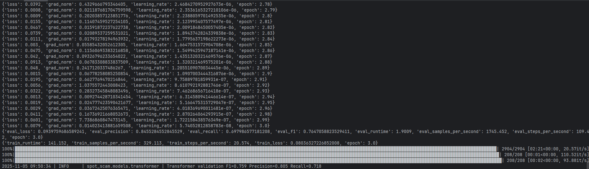

# Spot the Scam - Detailed Setup & Operations Guide

This guide walks through end-to-end setup, training, and serving of the Spot the Scam project. Follow the sections in order for a clean experience.

---

## 1. Prerequisites

| Requirement | Notes |
|-------------|-------|
| **Python 3.12+** | Project tested on 3.12; virtual environment strongly recommended. |
| **Node.js 18+ / npm 9+** | Required for the Next.js dashboard in `frontend/`. |
| **CUDA-capable GPU** | Optional but recommended for transformer training. |
| **Kaggle CLI** | Needed to download the Kaggle dataset (set up API token). |
| **Google Gemini API Key** | Optional; required for AI chatbot feature. Get from [Google AI Studio](https://makersuite.google.com/app/apikey). |

Ensure `python3`, `pip`, `node`, and `npm` are on your `PATH`.

---

## 2. Initial Repository Setup

```bash
git clone <repo-url> spot-the-scam-project
cd spot-the-scam-project
```

Create and activate a virtual environment (example using `venv`):

```bash
python3 -m venv .venv
source .venv/bin/activate  # Windows: .venv\Scripts\activate
```

Install Python dependencies (includes dev tooling):

```bash
pip install -e '.[dev]'
```

> [!TIP]
> **Tip:** If you hit network restrictions, rerun with `pip install --no-cache-dir -e .[dev]`.

> [!TIP]
> Remove the quote marks around `.[dev]` if using Windows Command Prompt.

---

## 3. Data Acquisition

1. Configure Kaggle CLI (`~/.kaggle/kaggle.json` must exist with your API key).
2. Download the dataset into `data/`:

```bash
./scripts/download_data.py
```

The script downloads and extracts `fake_job_postings.csv` (and the alternate `Fake_Real_Job_Posting.csv`) into `data/`. Raw files remain Git-ignored.

> [!TIP]
> We have included the full datasets in `data/` for convenience. If you re-download, existing files will be overwritten.

---

## 4. Preparing the Environment

### 4.1 Directory Setup

The training pipeline expects certain directories; they are created automatically, but you can ensure they exist with:

```bash
python -c "from spot_scam.utils.paths import ensure_directories; ensure_directories()"
```

### 4.2 Environment Variables

Create a `.env` file in the project root for backend configuration:

```bash
# Backend Environment Variables (.env)

# Required for AI chatbot (optional - chatbot won't work without this)
GEMINI_API_KEY=your_gemini_api_key_here

# CORS origins (comma-separated)
SPOT_SCAM_ALLOWED_ORIGINS=http://localhost:3000,http://127.0.0.1:3000

# Optional: Use quantized transformer model
SPOT_SCAM_USE_QUANTIZED=0

# MLflow tracking
MLFLOW_TRACKING_URI=file:///app/mlruns
```

For the frontend, create `frontend/.env.local`:

```bash
# Frontend Environment Variables (frontend/.env.local)

# API base URL (defaults to http://localhost:8000 if not set)
NEXT_PUBLIC_API_BASE_URL=http://localhost:8000
```

> [!TIP]
> Use `.env.example` and `frontend/.env.local.example` as templates. Never commit these files to version control (already in `.gitignore`).

---

## 5. Training the Models

### 5.1 Full Training (classical + transformer)

```bash
PYTHONPATH=src python -m spot_scam.pipeline.train
```

This run:
- Cleans data, creates stratified splits (`data/processed/`).
- Trains classical baselines (logistic regression, linear SVM, LightGBM).
- Fine-tunes DistilBERT (mixed precision if GPU available).
- Calibrates probabilities, writes artifacts to `artifacts/`.
- Generates figures/metrics/tables in `experiments/`.

> [!NOTE]
> If you have limited resources on your machine, consider using the classical-only training mode below for faster iterations. The Transformer training can be time and memory intensive.

> [!CAUTION]
> After the XGBoost update, the pipeline is now considerably longer to run (up to 3-4 hrs depending on hardware), even without Transformer training. Please be patient as the system has to explore multiple hyperparameter combinations.

### 5.2 Classical-Only Training (faster)

This mode skips transformer training for quicker iterations:

```bash
PYTHONPATH=src python -m spot_scam.pipeline.train --skip-transformer
```

> **Outputs:**  
> - `artifacts/metadata.json` - summary (metrics, threshold, gray-zone).  
> - `artifacts/model.joblib` - calibrated estimator for inference.  
> - `artifacts/transformer/` - DistilBERT weights (if transformer was trained).  
> - `experiments/report.md` - markdown report with figures/tables.  

After training, you should get:



### 5.3 Optional Transformer Quantization

Create an INT8 dynamic-quantized checkpoint for faster CPU inference:

```bash
PYTHONPATH=src python -m spot_scam.pipeline.quantize
# or `make quantize-transformer`
```

This writes `artifacts/transformer/quantized/model.pt` and updates metadata. Quantization is opt-in; the standard (FP32) weights remain default.

### 5.4 Hyperparameter Tuning with Optuna (OPTIONAL)

For more advanced hyperparameter optimization beyond grid search, use Optuna to intelligently explore the hyperparameter space:

**Tune Logistic Regression:**
```bash
PYTHONPATH=src python scripts/tune_with_optuna.py --model-type logistic --n-trials 20
```

**Tune Linear SVM:**
```bash
PYTHONPATH=src python scripts/tune_with_optuna.py --model-type svm --n-trials 30
```

Optuna uses Bayesian optimization (TPE sampler) to find optimal hyperparameters. Unlike grid search, it can discover intermediate values (e.g., C=2.34 instead of just [0.1, 1.0, 10.0]).

**After tuning:**
1. Copy the best parameters from Optuna output
2. Update `configs/defaults.yaml` with the discovered values
3. Re-run full training: `PYTHONPATH=src python -m spot_scam.pipeline.train`

See [docs/optuna_tuning.md](docs/optuna_tuning.md) for detailed documentation and [docs/optuna_quickstart.md](docs/optuna_quickstart.md) for quick examples.

Quick visualization of tuning results (after a run):
```bash
OMP_NUM_THREADS=1 optuna-dashboard sqlite:///optuna_study.db --server wsgiref --host 127.0.0.1 --port 8080
```
Then choose the study (e.g., `logistic_regression_tuning` or `linear_svm_tuning`) from the dashboard dropdown.

<p align="center">
  
</p>

### 5.5 Automatic ONNX + MLflow Export (OPTIONAL)

Every completed training run attempts to:

1. Convert the selected winner to ONNX (both classical and transformer variants are supported).
2. Package preprocessing assets (TF‑IDF vectorizer, scaler, tokenizer) alongside the executable ONNX graph.
3. Log a full MLflow pyfunc model at `runs:/<RUN_ID>/model`, bundling the gray-zone policy so served predictions behave like the API.

Artifacts land inside the configured tracking URI (defaults to `mlruns/`). You can inspect them via the MLflow UI or serve locally:

```bash
mlflow models serve --env-manager local -m runs:/<RUN_ID>/model -p 8080
```

Use `--env-manager local` so MLflow reuses the existing `.venv` (the default `virtualenv` manager expects `pyenv` to be installed system-wide).

Set `mlflow.enabled: false` in `configs/defaults.yaml` if you need to disable export.

---

## 6. Running the FastAPI Service

Activate the virtual environment if not already active, then:

```bash
source .venv/bin/activate
PYTHONPATH=src uvicorn spot_scam.api.app:app --host 0.0.0.0 --port 8000 --reload
```

To force the API to use the quantized transformer (if available):

```bash
export SPOT_SCAM_USE_QUANTIZED=1
PYTHONPATH=src uvicorn spot_scam.api.app:app --host 0.0.0.0 --port 8000 --reload
```

If the dashboard runs on a different origin, enable CORS before launching the API:

```bash
export SPOT_SCAM_ALLOWED_ORIGINS="http://localhost:3000,https://your-domain.com"
PYTHONPATH=src uvicorn spot_scam.api.app:app --host 0.0.0.0 --port 8000 --reload
```

### Useful Endpoints

| Endpoint                         | Description                                                    |
|----------------------------------|----------------------------------------------------------------|
| `GET /health`                    | Simple health + model summary.                                 |
| `GET /metadata`                  | Model metadata, thresholds, metrics.                           |
| `POST /predict`                  | Batch predictions (`{ "instances": [JobPostingInput, ...] }`). |
| `POST /predict/single`           | Single prediction (body is `JobPostingInput`).                 |
| `GET /insights/token-importance` | Top TF‑IDF coefficients for fraud/legit terms.                 |
| `GET /insights/token-frequency`  | Token frequency differences between classes.                   |
| `POST /chat`                     | Stream chat responses from Google Gemini (requires API key).   |

Example curl:

```bash
curl -X POST http://localhost:8000/predict/single \
  -H "Content-Type: application/json" \
  -d '{
        "title": "Remote Data Entry Specialist",
        "description": "We are urgently hiring... purchase laptop...",
        "requirements": "Detail oriented..."
      }'
```

---

## 7. Frontend Dashboard (Next.js + Tailwind + shadcn)

### 7.1 Install Dependencies

```bash
cd frontend
npm install
```

### 7.2 Configure API URL

Copy the example env file and tweak if the API runs elsewhere:

```bash
cp .env.local.example .env.local
# edit NEXT_PUBLIC_API_BASE_URL if needed (default http://localhost:8000)
```

### 7.3 Development Server

```bash
npm run dev
```

Visit `http://localhost:3000` to access the dashboard:
- **Score page (`/`)**: Submit job postings for scoring, view metrics and decision rationale
- **Review page (`/review`)**: Human-in-the-loop feedback and case triage
- **Chat page (`/chat`)**: AI-powered chatbot for fraud detection insights

### 7.4 Code Quality & Linting

The frontend includes comprehensive formatting and linting tools:

```bash
# Check code formatting
npm run format:check

# Auto-format all code
npm run format

# Lint TypeScript/JavaScript
npm run lint

# Auto-fix linting issues
npm run lint:fix

# Type check with TypeScript
npm run type-check

# Run all checks
npm run check-all
```

**Available Scripts:**
- `npm run dev` - Start development server
- `npm run build` - Build for production
- `npm run start` - Start production server
- `npm run lint` - Lint code with ESLint
- `npm run lint:fix` - Auto-fix linting issues
- `npm run format` - Format code with Prettier
- `npm run format:check` - Check code formatting
- `npm run type-check` - Run TypeScript compiler
- `npm run check-all` - Run all checks (type + lint + format)

> [!TIP]
> Run `npm run check-all` before committing to ensure code quality.

> [!IMPORTANT]
> Run `source .venv/bin/activate && python -m black . && (cd frontend && npm run format)` to format both backend and frontend codebases, BEFORE committing changes and pushing to remote!!!

---

## 8. AI Chatbot (Google Gemini Integration)

The project includes an AI-powered chatbot that helps users understand fraud detection results.

### 8.1 Setup

1. **Get your Gemini API Key:**
   - Visit [Google AI Studio](https://makersuite.google.com/app/apikey)
   - Sign in and create an API key
   - Copy the generated key

2. **Add to environment:**
   ```bash
   # In .env file (project root)
   GEMINI_API_KEY=your_api_key_here
   ```

3. **Restart the backend server:**
   ```bash
   make serve
   # or
   PYTHONPATH=src uvicorn spot_scam.api.app:app --host 0.0.0.0 --port 8000 --reload
   ```

### 8.2 Features

- **Streaming Responses**: Real-time AI responses powered by Google Gemini 1.5 Flash
- **Context-Aware**: Automatically includes fraud detection results and job posting details
- **Persistent History**: Chat history saved in browser localStorage
- **Beautiful UI**: Modern chat interface with animations and gradients
- **Error Robust**: Works even without prediction context

### 8.3 Usage

**Option 1: From Score Page**
1. Analyze a job posting on the Score page (`/`)
2. Click the **"Ask AI about this result"** button
3. Start chatting with context automatically loaded

**Option 2: Direct Access**
1. Click the **"Chat"** tab in navigation
2. Ask general questions about job fraud detection

**Example Questions:**
- "Why is this job posting flagged as fraudulent?"
- "What are the red flags in this posting?"
- "Should I apply to this job?"
- "Explain the fraud indicators in simple terms"

### 8.4 Keyboard Shortcuts

- `Enter` - Send message
- `Shift + Enter` - New line in message

### 8.5 API Endpoint

**POST /chat** - Stream chat responses

```bash
curl -X POST http://localhost:8000/chat \
  -H "Content-Type: application/json" \
  -d '{
    "message": "Why is this job suspicious?",
    "context": {
      "job_posting": {...},
      "prediction": {...}
    }
  }'
```

Response is streamed as Server-Sent Events (SSE):
```
data: {"chunk": "This job posting ", "done": false}
data: {"chunk": "appears suspicious because...", "done": false}
data: {"chunk": "", "done": true}
```

### 8.6 Troubleshooting

**Problem: "GEMINI_API_KEY not set" error**
- Solution: Add `GEMINI_API_KEY=your_key` to `.env` and restart backend

**Problem: CORS errors**
- Solution: Check `SPOT_SCAM_ALLOWED_ORIGINS` includes your frontend URL

**Problem: Chatbot works but no job context**
- Solution: Navigate from Score page after running a prediction, or use chatbot standalone (works without context)

---

## 9. Human-in-the-Loop Review & Feedback

1. **Serve the API for review workflows**
   ```bash
   make serve-queue
   ```
   This launches the FastAPI app with review endpoints (`/cases`, `/feedback`, `/insights/*`).

2. **Populate the review queue**
   - Execute real predictions via the dashboard (`/`) – each call logs sanitized payloads under `tracking/predictions/date=*/`.
   - Optionally sample from historical predictions:
     ```bash
     make review-sample        # writes experiments/tables/active_sample.csv
     ```

3. **Process cases in the UI**
   - Visit `http://localhost:3000/review` to open the triage drawer.
   - Each card shows model rationale, token contributions, and sanitized text.
   - Submit labels via `Confirm Fraud`, `Confirm Legit`, or `Unsure`. Notes and rationale fields are masked for PII before being persisted to `tracking/feedback/date__*/`.

4. **Retrain with feedback**
   ```bash
   make retrain-with-feedback
   ```
   The pipeline merges reviewer labels (ignoring `unsure`), recalculates stratified splits, and emits comparison artifacts:
   - `experiments/tables/metrics_with_feedback.csv`
   - `experiments/tables/slice_metrics_baseline.csv`
   - `experiments/tables/slice_metrics_feedback_delta.csv`
   - `experiments/tables/feedback_counts.csv`

5. **Schedule periodic sampling** (optional)
   - The helper script `scripts/sample_uncertain.py` supports entropy or margin sampling (`python scripts/sample_uncertain.py --policy entropy --limit 200`).
   - Integrate with cron to refresh `active_sample.csv` for reviewers.

---

## 10. Code Quality & Development Tools

The project includes comprehensive formatting and linting tools for both Python and TypeScript.

### 10.1 Python Tools

**Formatting (Black):**
```bash
make format              # Format all Python code
make format-check        # Check formatting without changes
```

**Linting (Ruff):**
```bash
make lint                # Check for linting issues
make lint-fix            # Auto-fix linting issues
```

**Type Checking (mypy):**
```bash
make type-check          # Run mypy on src/
```

**All Checks:**
```bash
make check-all           # Run format-check + lint + type-check
```

**Cleanup:**
```bash
make clean               # Remove Python cache files
```

### 10.2 TypeScript/Frontend Tools

**Formatting (Prettier):**
```bash
make frontend-format          # Format all TypeScript code
make frontend-format-check    # Check formatting
```

**Linting (ESLint):**
```bash
make frontend-lint            # Check for linting issues
make frontend-lint-fix        # Auto-fix linting issues
```

**Type Checking (TypeScript):**
```bash
make frontend-type-check      # Run TypeScript compiler
```

**All Checks:**
```bash
make frontend-check           # Run all frontend checks
```

### 10.3 Pre-commit Hooks

Install pre-commit hooks to automatically check code quality before commits:

```bash
# Install pre-commit
pip install pre-commit

# Install hooks
pre-commit install

# Run manually on all files
pre-commit run --all-files
```

**What gets checked:**
- Trailing whitespace removal
- End-of-file fixing
- YAML/JSON/TOML validation
- Python: Black formatting, Ruff linting, mypy type checking
- TypeScript: Prettier formatting, ESLint linting

**Skip hooks (not recommended):**
```bash
git commit --no-verify -m "commit message"
```

### 10.4 Help Command

View all available Make commands:

```bash
make help
```

---

## 11. Helpful Make Targets

From project root:

### Training & Serving

| Command                      | Purpose                                                        |
|------------------------------|----------------------------------------------------------------|
| `make install`               | Install Python dependencies (same as `pip install -e .[dev]`). |
| `make train`                 | Run full training pipeline.                                    |
| `make train-fast`            | Train classical models only.                                   |
| `make serve`                 | Launch FastAPI server on port 8000.                            |
| `make serve-queue`           | Launch FastAPI server with review endpoints.                   |
| `make test`                  | Execute unit tests with coverage.                              |
| `make review-sample`         | Sample uncertain predictions.                                  |
| `make retrain-with-feedback` | Run training with reviewer overrides.                          |

### Python Code Quality

| Command              | Purpose                                    |
|----------------------|--------------------------------------------|
| `make format`        | Format Python code with Black.             |
| `make format-check`  | Check Python formatting.                   |
| `make lint`          | Lint Python code with Ruff.                |
| `make lint-fix`      | Auto-fix Python linting issues.            |
| `make type-check`    | Run mypy type checking.                    |
| `make check-all`     | Run all Python checks.                     |
| `make clean`         | Clean Python cache files.                  |

### Frontend Development

| Command                      | Purpose                                    |
|------------------------------|--------------------------------------------|
| `make frontend-install`      | Install frontend dependencies.             |
| `make frontend`              | Start Next.js dev server.                  |
| `make frontend-format`       | Format TypeScript code with Prettier.      |
| `make frontend-format-check` | Check TypeScript formatting.               |
| `make frontend-lint`         | Lint TypeScript code with ESLint.          |
| `make frontend-lint-fix`     | Auto-fix TypeScript linting issues.        |
| `make frontend-type-check`   | Run TypeScript type checking.              |
| `make frontend-check`        | Run all frontend checks.                   |

### Utilities

| Command      | Purpose                              |
|--------------|--------------------------------------|
| `make help`  | Show all available make commands.    |

> [!TIP]
> Run `make check-all` and `make frontend-check` before committing code.

---

## 12. Testing & Quality Assurance

### 12.1 Python Tests

```bash
# Run all tests with coverage
make test

# Or manually
source .venv/bin/activate
PYTHONPATH=src pytest
```

### 12.2 Code Quality Checks

**Before committing, always run:**

```bash
# Python checks
make check-all         # Runs format-check + lint + type-check

# TypeScript checks
make frontend-check    # Runs format-check + lint + type-check
```

**Or use pre-commit hooks:**

```bash
pip install pre-commit
pre-commit install

# Now checks run automatically on git commit
```

### 12.3 Manual API Testing

```bash
# Health check
curl http://localhost:8000/health

# Single prediction
curl -X POST http://localhost:8000/predict/single \
  -H "Content-Type: application/json" \
  -d '{"title": "Software Engineer", "description": "..."}'

# Chat endpoint
curl -X POST http://localhost:8000/chat \
  -H "Content-Type: application/json" \
  -d '{"message": "Hello!"}'
```

### 12.4 Frontend Testing

```bash
cd frontend

# Type check
npm run type-check

# Lint
npm run lint

# Format check
npm run format:check

# All checks
npm run check-all
```

---

## 13. Docker & Devcontainer

### 11.1 Docker Compose Runtime

```bash
docker compose build
docker compose up -d
```

- FastAPI: <http://localhost:8000> · Next.js dashboard: <http://localhost:3000>.
- Host directories `configs/`, `artifacts/`, `experiments/`, `mlruns/`, and `data/` are mounted for persistence. Ensure trained artifacts exist (or train inside the container) before relying on the API.
- The stack sets `MLFLOW_TRACKING_URI=file:///app/mlruns` so containerised jobs log to the shared `mlruns/` volume. CORS defaults allow the bundled frontend, but override via `SPOT_SCAM_ALLOWED_ORIGINS` if you expose the API elsewhere.
- Execute ad-hoc tasks inside the API container:

```bash
docker compose exec api bash
PYTHONPATH=src python -m spot_scam.pipeline.train --skip-transformer
```

### 13.2 Devcontainer (VS Code)

1. Install the Dev Containers extension.
2. Open the repository and select **“Reopen in Container”**.
3. The container provisions Python 3.12 and Node 20, runs `pip install -e .[dev] && npm install --prefix frontend`, and forwards ports `8000/3000`.

> [!NOTE]
> When using Docker, environment variables can be passed via `docker-compose.yml` or a `.env` file. Make sure to set `GEMINI_API_KEY` if you want to use the chatbot feature.

---

## 14. Cleanup & Regeneration

To regenerate artifacts/experiments:

```bash
rm -rf artifacts/* experiments/* data/processed/* tracking/*
PYTHONPATH=src python -m spot_scam.pipeline.train
```

> **Warning:** Removing these folders deletes trained models and reports. Ensure you have backups if needed.

---

## 15. Troubleshooting Tips

### General Issues

- **Missing CUDA / GPU fallback:** Transformer training will automatically use CPU if CUDA is unavailable (slower). Ensure `torch.cuda.is_available()` returns `True` for GPU acceleration.
- **Network hiccups when installing packages:** Retry with `--no-cache-dir`, or pre-download wheels if proxies are involved.
- **Kaggle authentication errors:** Ensure `KAGGLE_USERNAME` and `KAGGLE_KEY` env vars are set or `~/.kaggle/kaggle.json` has correct permissions (`chmod 600`).
- **Frontend 404s:** Confirm FastAPI and Next.js are running; check `NEXT_PUBLIC_API_BASE_URL`.

### Chatbot Issues

- **"GEMINI_API_KEY not set" error:**
  - Add `GEMINI_API_KEY=your_key` to `.env` file in project root
  - Restart the backend server
  - Verify the key is correct from Google AI Studio

- **CORS errors in chatbot:**
  - Check `SPOT_SCAM_ALLOWED_ORIGINS` in `.env`
  - Ensure it includes your frontend URL (e.g., `http://localhost:3000`)
  - Restart backend after changes

- **Streaming not working:**
  - Check browser DevTools → Network tab for SSE connection
  - Try a different browser (Chrome/Firefox recommended)
  - Ensure backend is returning `text/event-stream` content type

- **Chat has no context:**
  - This is normal when accessing `/chat` directly
  - Navigate from Score page after running a prediction to include context
  - Chatbot works fine without context, just won't have specific job details

### Code Quality Issues

- **Black and Ruff conflicts:**
  ```bash
  # Format with Black first
  black src/
  # Then run Ruff
  ruff check --fix src/
  ```

- **ESLint cache issues:**
  ```bash
  cd frontend
  rm -rf .eslintcache node_modules/.cache
  npm install
  npm run lint
  ```

- **Pre-commit hook failures:**
  ```bash
  # Update hooks
  pre-commit autoupdate
  # Clear cache
  pre-commit clean
  # Reinstall
  pre-commit install --install-hooks
  ```

- **Type checking errors:**
  ```bash
  # Install type stubs
  pip install types-all
  # Run with verbose output
  mypy --show-error-codes src/
  ```
