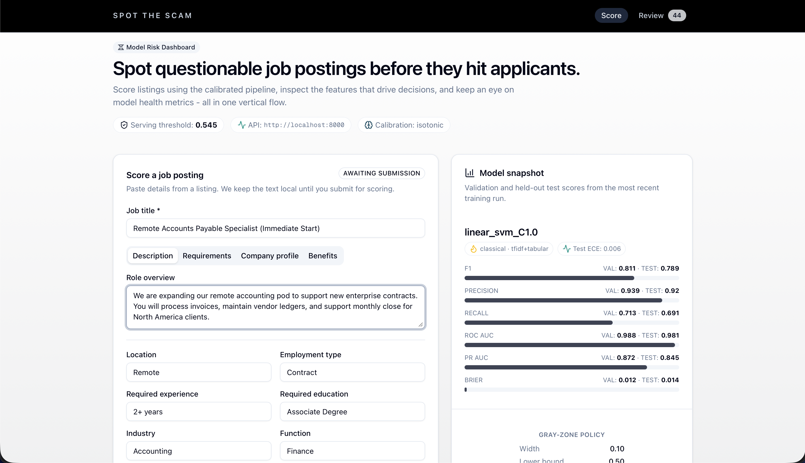
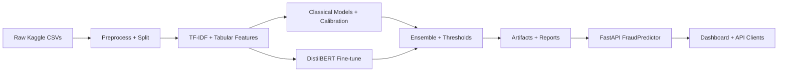
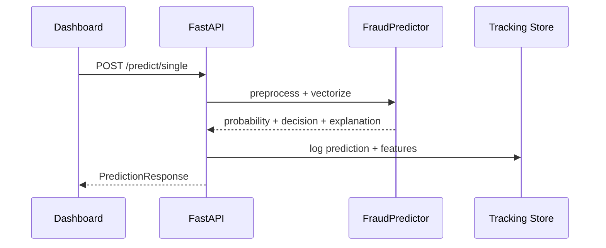

# Spot the Scam - AI Job Fraud Detection


Spot the Scam is an uncertainty-aware fraud detector for job postings. It combines calibrated classical ML, optional transformer fine-tuning, and explainable outputs so reviewers can act fast and confidently.

<p align="center">
  
</p>

This README provides an end-to-end overview, from model training and calibration through deployment and review workflows. For deeper dives, the Documentation map section links to detailed guides and architecture diagrams.

## Why it matters

Job seekers face increasingly sophisticated scams. This project focuses on high-precision detection, calibrated confidence scores, and a human-in-the-loop workflow that keeps false alarms low while catching real threats.

## Design principles

The system prioritizes precision so that reviewers can act on alerts without drowning in false positives. It emphasizes calibration so probability thresholds can be trusted for triage. It also favors transparency, which is why every prediction includes interpretable feature contributions.

## Use cases

- Teams can screen inbound postings on job boards or marketplaces.
- Trust and safety groups can triage reports for recruiting and HR operations.
- Analysts can run fraud research and benchmarking on job posting datasets.
- Educators can use the dashboard as a demo-ready interface for stakeholders.

## Core capabilities

- **High-precision ensemble** combines TF-IDF text features with tabular signals.
- **Calibration-first design** uses Platt or isotonic calibration for reliable scores.
- **Classical and transformer options** include Logistic Regression, Linear SVM, XGBoost, LightGBM, and optional DistilBERT.
- **Gray-zone policy** routes low-confidence cases to manual review.
- **Explainability** provides token-level contributions for transparent decisions.
- **Interactive dashboard** supports scoring, review, and AI-assisted analysis.
- **Production-ready packaging** ships models via ONNX, MLflow, FastAPI, and Docker.
- **Optuna tuning** enables Bayesian hyperparameter optimization.
- **Human-in-the-loop feedback** captures reviewer labels for retraining.

## Model stack and decision policy

The default inference path uses calibrated classical models because they are fast, interpretable, and reliable on short-text job postings. The pipeline can also fine-tune DistilBERT for richer semantic signals when GPU resources are available. The best validation performer can be selected directly or blended into a weighted ensemble that improves stability.

The decision policy combines a primary threshold with a gray-zone band. Scores that fall inside the band are routed to human review, which keeps precision high while still surfacing ambiguous cases for analyst attention.

## Results at a glance

| Metric    | Validation | Test  |
|-----------|------------|-------|
| F1        | 0.856      | 0.772 |
| Precision | 0.930      | 0.854 |
| ROC-AUC   | 0.989      | 0.986 |
| Brier     | 0.010      | 0.014 |

Calibration is strong (ECE: 0.0066), making confidence thresholds meaningful for triage.
The project intentionally prioritizes precision to reduce false positives while still maintaining strong recall. Brier score and calibration metrics help validate that predicted probabilities can be used for operational decisions. You can adjust thresholds and gray-zone bands in configuration when your risk tolerance changes.

## Live demo

- The frontend demo is available at https://spot-the-scam-job-fraud.vercel.app/ and uses demo data and a demo model.
- The demo video is available at https://drive.google.com/file/d/15RXs3h79aPqJ6X6BtHP0u3mTl1gkYqVE/view?usp=sharing.

## System overview

The training pipeline follows these steps:
1. Ingest and preprocess Kaggle job posting data with stratified splits.
2. Build TF-IDF and tabular features.
3. Train calibrated classical models and optional DistilBERT.
4. Select or ensemble best candidates, then persist artifacts and reports.

The serving pipeline follows these steps:
1. FastAPI loads a cached `FraudPredictor` with vectorizers, models, and metadata.
2. Requests are scored, calibrated, and passed through the gray-zone policy.
3. Responses include labels, probabilities, and explainability outputs.

The AI assistant behaves as follows:
- The `/chat` route delegates to Gemini when available and injects model context for detected job posts.
- The dashboard streams responses via SSE and keeps recent context on the client.
- The assistant can operate without prediction context, but responses are richer when scoring has occurred.

The diagram below summarizes the training and serving flow.



## Explainability and decision rationale

Every prediction includes a compact rationale that highlights the most influential tokens and signals. The API returns these contributions and the dashboard renders them in the decision rationale card. See `docs/explainability.md` for implementation details and examples.

Explanations include both positive and negative drivers, plus an optional intercept and a natural-language summary. Token contributions are labeled with their source, so reviewers can see whether evidence came from the text or engineered tabular features.

## Human-in-the-loop workflow

Low-confidence predictions are routed to the gray zone and can be reviewed by a human analyst. Review feedback is stored for retraining runs, which allows the system to improve over time with real-world labels. The review UI in the dashboard is designed to make this workflow straightforward.

The workflow includes the following steps.
- The API logs predictions for review and persists them under `tracking/`.
- Reviewers label cases as fraud, legit, or unsure and optionally add rationale.
- The retraining pipeline can incorporate confirmed labels to refresh calibration and thresholds.

## Evaluation and calibration

The project tracks precision, F1, ROC-AUC, and Brier scores, and it uses reliability checks to validate calibration quality. Calibration options include Platt scaling and isotonic regression, and the results are summarized in `experiments/` after each run. This focus ensures that probability thresholds are meaningful for triage decisions.

The evaluation suite also supports threshold sweeps and slice metrics, which help teams understand how performance varies across posting attributes. These analyses are useful when deploying to new domains or when monitoring for drift.

## Data and training

- The source dataset is the Kaggle job posting fraud collection (`fake_job_postings.csv`, `Fake_Real_Job_Posting.csv`).
- Data files are included in `data/` for convenience, and you can re-download them with `./scripts/download_data.py` if needed.
- Full training runs with `PYTHONPATH=src python -m spot_scam.pipeline.train`.
- Classical-only training runs with `PYTHONPATH=src python -m spot_scam.pipeline.train --skip-transformer`.
- Hyperparameter tuning runs with `PYTHONPATH=src python scripts/tune_with_optuna.py --model-type logistic --n-trials 20`.

The pipeline writes stratified splits to `data/processed/` for reproducibility, and it stores artifacts and reports under `artifacts/` and `experiments/`. This structure makes it easy to compare runs, inspect errors, and trace decisions back to their sources.

## Feature engineering and signals

Text fields are concatenated into a unified `text_all` representation and vectorized with TF-IDF for classical models. Tabular features capture lengths, counts, and binary flags such as telecommuting and company logo presence. The feature builder combines these signals into a single sparse matrix, and tabular features are scaled before model training.

## Serving, review, and chat

- The scoring endpoints `/predict/single` and `/predict` return calibrated scores and explanations.
- The insights endpoints under `/insights/*` expose token importance and slice analytics for the dashboard.
- The review workflow logs predictions for human review and feedback-driven retraining.
- The `/chat` endpoint streams Gemini responses with model context and requires `GEMINI_API_KEY`.

These endpoints power the dashboard experience, including the decision rationale card, review queue, and streaming assistant.

The diagram below shows the request lifecycle for a single prediction.



## Frontend experience

The Next.js dashboard surfaces three primary experiences: scoring, review, and chat. The score page is optimized for quick input and fast feedback, the review page supports case triage, and the chat page provides AI-assisted explanations that stream in real time. Styling is built with Tailwind and shadcn to keep the interface consistent and lightweight.

## Quickstart

### Option A: Docker (fastest end-to-end)

```bash
docker compose build
docker compose up -d
```

FastAPI runs on `http://localhost:8000` and the dashboard on `http://localhost:3000`. If you do not have trained artifacts yet, follow the training step below or see `DOCKER.md`.

### Option B: Local development

```bash
python3 -m venv .venv
source .venv/bin/activate
pip install -e '.[dev]'
```

Train a classical-only model for faster iterations with the command below.

```bash
PYTHONPATH=src python -m spot_scam.pipeline.train --skip-transformer
```

Run the API with the command below.

```bash
PYTHONPATH=src uvicorn spot_scam.api.app:app --host 0.0.0.0 --port 8000 --reload
```

Run the frontend with the commands below.

```bash
cd frontend
npm install
npm run dev
```

For full setup details, environment variables, and GPU guidance, see `INSTRUCTIONS.md`.
If you want the chat assistant, add `GEMINI_API_KEY` to `.env` before starting the API.

## API quick test

The request below scores a single posting and returns the calibrated decision with explanations.

```bash
curl -X POST http://localhost:8000/predict/single \
  -H "Content-Type: application/json" \
  -d '{
        "title": "Remote Data Entry Specialist",
        "description": "We are urgently hiring... purchase laptop...",
        "requirements": "Detail oriented..."
      }'
```

## Example prediction response

The response schema is defined in `src/spot_scam/api/schemas.py`, and the example below is an abridged response for a single posting.

```json
{
  "request_id": "req_8f3d2c1a",
  "probability_fraud": 0.91,
  "binary_label": 1,
  "decision": "fraud",
  "threshold": 0.5,
  "gray_zone": {
    "width": 0.1,
    "lower": 0.45,
    "upper": 0.55,
    "positive_label": "fraud",
    "negative_label": "legit",
    "review_label": "review"
  },
  "meta": {
    "model_type": "classical",
    "model_name": "linear_svm"
  },
  "explanation": {
    "top_positive": [
      { "feature": "wire transfer", "source": "token", "contribution": 0.42 }
    ],
    "top_negative": [
      { "feature": "benefits", "source": "token", "contribution": -0.18 }
    ],
    "intercept": -0.12,
    "summary": "Wire transfer pushed the score toward fraud."
  }
}
```

## Configuration

- Backend environment variables live in `.env`, and `INSTRUCTIONS.md` provides a template.
- Frontend environment variables live in `frontend/.env.local`.
- YAML config defaults live in `configs/defaults.yaml`, and you can override them as needed.
- Key environment variables include `GEMINI_API_KEY`, `SPOT_SCAM_ALLOWED_ORIGINS`, and `SPOT_SCAM_USE_QUANTIZED`.

## Input schema

The API accepts a structured job posting payload defined in `src/spot_scam/api/schemas.py`. The `title` field is required, and optional fields include `location`, `department`, `salary_range`, `company_profile`, `description`, `requirements`, `benefits`, `employment_type`, `required_experience`, `required_education`, `industry`, and `function`. Boolean-style flags such as `telecommuting`, `has_company_logo`, and `has_questions` help capture quick heuristics about posting quality.

## Common make targets

The Makefile provides convenient entry points for common tasks. You can use `make train` for full training, `make train-fast` for classical-only training, `make serve` for the API, and `make frontend` for the dashboard. The same Makefile includes quality checks such as `make test`, `make check-all`, and `make frontend-check`.

## Artifacts and outputs

| Location | Contents |
|----------|----------|
| `artifacts/model.joblib` | This file stores the calibrated estimator used for inference. |
| `artifacts/metadata.json` | This file stores metrics, thresholds, and the gray-zone policy. |
| `artifacts/features/` | This folder stores the TF-IDF vectorizer, scaler, and feature names. |
| `artifacts/transformer/` | This folder stores DistilBERT checkpoints when transformer training runs. |
| `experiments/` | This folder stores reports, figures, and evaluation tables. |
| `data/processed/` | This folder stores persisted train, validation, and test splits. |

## Reproducibility and versioning

The pipeline persists dataset splits, configurations, and training artifacts so that runs can be reproduced and compared. This structure makes it easier to track performance changes across experiments, and it supports auditing when you need to explain why a decision was made.

## Extending the model suite

The pipeline is configuration-driven, which makes it straightforward to introduce new models and feature variations. `ADD_MODELS.md` walks through the steps to register a model, log metrics, and export artifacts. This approach keeps experimental changes consistent with the existing evaluation and reporting pipeline.

## MLOps and deployment

- **Docker Compose** runs FastAPI and Next.js together for local deployment.
- **ONNX exports** enable portable inference for classical and transformer models.
- **MLflow pyfunc packaging** bundles preprocessing and gray-zone logic for serving parity.
- **Quantization** is supported for faster transformer inference on CPU.

See `DOCKER.md` and `docs/deployment_guide.md` for production-oriented deployment guidance.
The frontend is compatible with Vercel and standard Node hosting environments, and the API can run as a containerized service behind a reverse proxy. The MLflow export path is useful when you want to serve the model without the full FastAPI application.

## Observability and tracking

The training pipeline records metrics, artifacts, and plots in `experiments/`, and it can publish models to MLflow for registry and serving parity. The API logs prediction events for review workflows, and these records can be used to audit decisions and retrain on confirmed labels.

## Testing and quality

- Python checks run with `make test` and `make check-all`.
- Frontend checks run with `make frontend-check`.
- Formatting and linting run with `make format`, `make lint`, `make frontend-format`, and `make frontend-lint`.

Run the checks locally before opening a pull request to keep the repository consistent.

## Security and privacy notes

Job postings can include sensitive personal and corporate information. You should review data handling practices before deploying and avoid logging raw user-submitted content without a clear retention policy. If you plan to use the chat assistant, ensure that your use of third-party APIs complies with your data governance requirements.
Avoid sending sensitive data to external services unless you have explicit approval and a documented retention policy.

## Limitations and considerations

The current models are trained on a public Kaggle dataset, so real-world distributions may drift over time. Performance can vary across regions, industries, and posting formats, so calibration should be revisited when deploying to new domains. Transformer training and inference require significantly more resources than classical models, which can impact iteration speed.

## FAQ

- **Do I need a Gemini API key?** You can run the system without Gemini, but the `/chat` endpoint will be unavailable without `GEMINI_API_KEY`.
- **Do I need a GPU?** You can train and serve models without a GPU, although transformer fine-tuning will take significantly longer.
- **Does the demo run the full model?** The hosted demo uses demo data and a demo model rather than the full trained artifacts.
- **Can I skip transformers entirely?** You can run classical-only training with the `--skip-transformer` flag when you want faster iteration.

## Repository map

| Path | Description |
|------|-------------|
| `src/spot_scam/` | This directory holds the core pipeline for ingest, features, models, evaluation, inference, and the API. |
| `configs/` | This directory stores YAML configuration defaults and overrides. |
| `scripts/` | This directory provides CLI helpers for training, tuning, and utilities. |
| `artifacts/` | This directory stores trained models, vectorizers, metadata, and ONNX exports. |
| `experiments/` | This directory stores metrics, plots, and reports. |
| `frontend/` | This directory contains the Next.js and Tailwind dashboard. |
| `docs/` | This directory contains deep-dive documentation, deployment guidance, and explainability notes. |

## Documentation map

- `INFO.md` provides a project overview and feature summary. See [INFO.md](INFO.md).
- `ARCHITECTURE.md` documents the system design and data flow. See [ARCHITECTURE.md](ARCHITECTURE.md).
- `INSTRUCTIONS.md` provides full setup, training, and operations guidance. See [INSTRUCTIONS.md](INSTRUCTIONS.md).
  - `RESULTS.md` captures metrics and visualizations. See [RESULTS.md](RESULTS.md).
- `TRAINING_ANALYSIS.md` explains the training pipeline analysis. See [TRAINING_ANALYSIS.md](TRAINING_ANALYSIS.md).
- `ADD_MODELS.md` shows how to add new models. See [ADD_MODELS.md](ADD_MODELS.md).
- `DOCKER.md` documents containerized deployment details. See [DOCKER.md](DOCKER.md).
- `docs/explainability.md` describes the interpretability approach. See [docs/explainability.md](docs/explainability.md).
- `docs/pipeline_walkthrough.md` provides an end-to-end pipeline walkthrough. See [docs/pipeline_walkthrough.md](docs/pipeline_walkthrough.md).
- `docs/optuna_quickstart.md` and `docs/optuna_tuning.md` explain hyperparameter tuning. See [docs/optuna_quickstart.md](docs/optuna_quickstart.md) and [docs/optuna_tuning.md](docs/optuna_tuning.md).
- `docs/deployment_guide.md` covers deployment guidance. See [docs/deployment_guide.md](docs/deployment_guide.md).

## Citing

If you use this project in research, cite it via `CITATION.cff`. The file is in the repository root.

## License

This project is licensed under the MIT License. See `LICENSE` for details.
