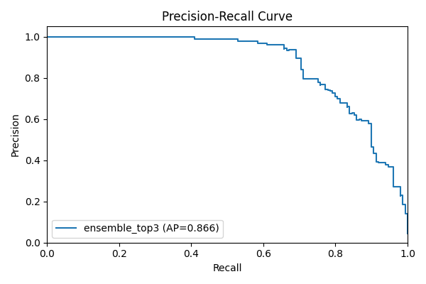
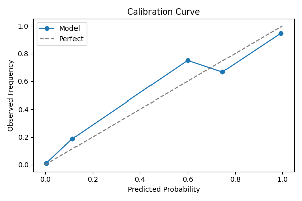
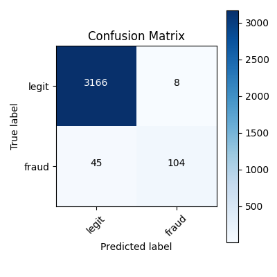
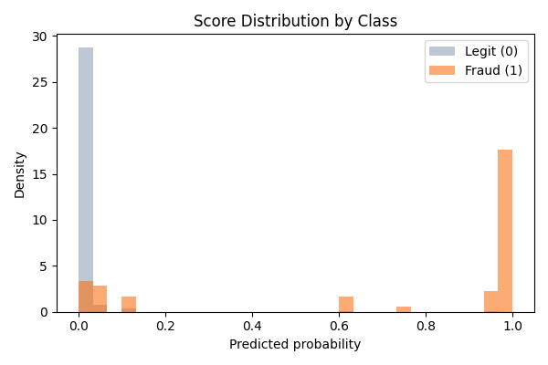
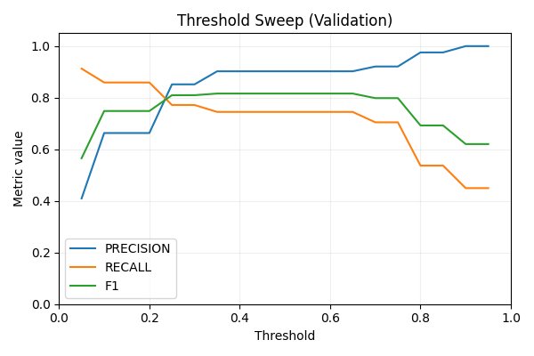
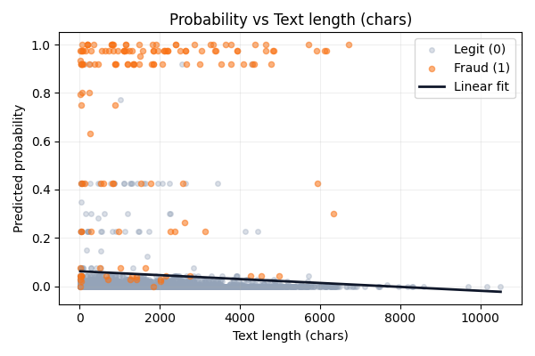
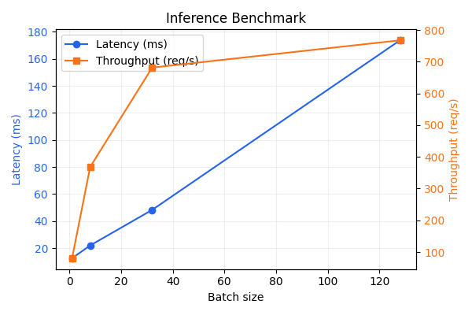

# Training Results

This document summarizes the results of the text classification experiment conducted using an ensemble model (ensemble_top3) with TF-IDF and tabular features. The model was trained to classify job postings as fraudulent or legitimate.

## Performance Snapshot
| split |       f1 | precision | recall | roc_auc | pr_auc |    brier |
|:------|--------:|----------:|-------:|--------:|-------:|---------:|
| validation | 0.8541 | 0.9160 | 0.8000 | 0.9867 | 0.8929 | 0.0108 |
| test | 0.7664 | 0.8400 | 0.7047 | 0.9833 | 0.8576 | 0.0149 |

- Expected calibration error (test): `0.0087`
- Decision threshold: `0.4137`
- Gray-zone width: `0.10`

## Model Diagnostics
### Precision-Recall

### Calibration

### Confusion Matrix

### Score Distribution

### Threshold Sweep (Validation)

### Probability vs. Text Length

### Inference Benchmark

## Explainability & Insights
- Token coefficients: `experiments/tables/top_terms_positive.csv` and `.../top_terms_negative.csv`
- Token frequency deltas: `experiments/tables/token_frequency_analysis.csv`
- Slice metrics: `experiments/tables/slice_metrics.csv`
- Probability regression stats: `experiments/tables/probability_regression.csv`
- Threshold sweep data: `experiments/tables/threshold_metrics.csv`
- Latency summary: `experiments/tables/benchmark_summary.csv`

All supporting CSVs live in `experiments/tables/` for reproducible analysis.

For more details and dynamically updated results, refer to [experiments/report.md](experiments/report.md) - which automatically regenerates all the numbers on each training run.
